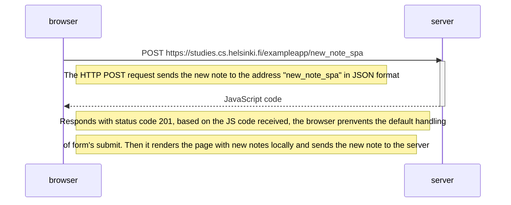

```mermaid
sequenceDiagram
    participant browser
    participant server

    browser->>server: POST https://studies.cs.helsinki.fi/exampleapp/new_note_spa
    activate server
    Note right of browser: The HTTP POST request sends the new note to the address "new_note_spa" in JSON format

    server-->>browser: JavaScript code
    deactivate server

    Note right of browser: Responds with status code 201, based on the JS code received, the browser prenvents the default handling
    Note right of browser:  of form's submit. Then it renders the page with new notes locally and sends the new note to the server

  
```